## AI Engineering Learning 2:
### Learn the most common real-world AI engineering pattern — grounding LLM answers in your own data.

- [ ] Embeddings and vector similarity (cosine similarity, why chunk size/overlap matters)
- [ ] Pick and learn one vector DB: Chroma (easiest to start), pgvector (if you want to stay in Postgres), or Pinecone
- [ ] Chunking strategies (fixed-size, semantic, recursive) and their tradeoffs
- [ ] Hybrid search (keyword + semantic) and reranking
- [ ] Citation/grounding — tracing an answer back to its source chunk

**Resources:**
- [Anthropic: Contextual Retrieval](https://www.anthropic.com/news/contextual-retrieval)
- [Anthropic Embeddings docs](https://docs.anthropic.com/en/docs/build-with-claude/embeddings)
- [Anthropic Academy — Build a RAG system with MongoDB / LlamaIndex](https://www.anthropic.com/learn/build-with-claude)
- [Chroma docs](https://docs.trychroma.com/)

**About:**
Here I am creating an augmented cookbook that fetches data from several cookbook PDFs, get embeddings from OpenAI *text-embedding-3-small* model and store them to a vector DB (TBA). 

This is a build from my previous repo for prompting basics.

**Architecutre**

Docs in Progress
